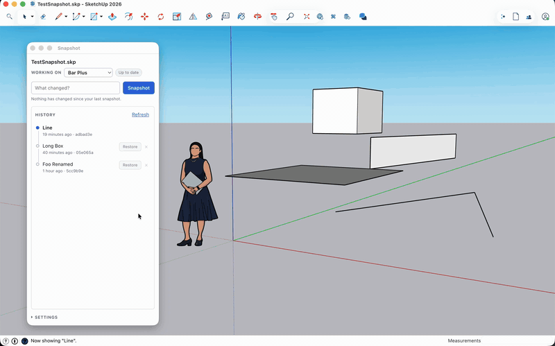

# Snapshot for SketchUp

Named save points for `.skp` files, and parallel variations for exploring
competing ideas — without relying on the linear undo stack, and without
learning git.

Nothing to install alongside it: no git, no gems, no account. Everything stays
in the folder your model lives in.

- **Snapshot** — save the current state with a short description.
- **Snapshot History** — every snapshot, newest first. Click one and the model
  becomes that version.
- **Variations** — a second line of snapshots, so two ideas can exist at once.
- **Dirty indicator** — the toolbar button highlights when you have work that
  is not snapshotted yet.



macOS and Windows, SketchUp 2019 and newer. MIT licensed.

## Installing

Get `snapshot_vcs-<version>.rbz` from
[Releases](https://github.com/rlueder/sketchup-snapshot/releases), or clone
this repository and run `rake build`.

In SketchUp: **Extensions → Extension Manager → Install Extension**, pick the
`.rbz`, restart.

## Using it

Save your model to a folder first — the history lives next to the `.skp`.

Open **Extensions → Snapshot → Snapshots…**, or use the toolbar. The panel opens
by itself the first time.

| | |
| --- | --- |
| Take a snapshot | Type what changed, hit **Snapshot**. |
| Go back | Click any entry. The list stays put; the marker moves. |
| Rename | Double-click a description. |
| Remove | **Remove** on the row. It leaves the list, not the disk. |
| New variation | The picker at the top of the panel. |

If you have unsnapshotted work when you go back, you are asked whether to keep
it or throw it away before anything happens.

## What it does to your folder

```
~/Projects/House/
├── House.skp
├── .git/            ← the history, created on your first snapshot
├── .gitattributes
└── .gitignore
```

It writes a real git repository, so your history stays readable with ordinary
git tools:

```sh
git log --all
git cat-file blob <sha>:House.skp    # recover a model by hand
```

Snapshot keeps its history under `refs/snapshots/*` and never touches `HEAD`,
the index, or any other file — so if the model already sits in a repository of
yours, your branches and staged changes carry on untouched. Existing git
history for the model shows up in the panel.

If you do have git installed, it is used for exactly one thing: reading history
back after someone runs `git gc`, which packs the loose objects Snapshot
writes.

## Limitations

- `.skp` is binary, so there is no diffing or merging. Snapshot and rollback
  only.
- Local only. No push, pull or multi-user sync.
- Every snapshot stores a whole copy of the model, and removing one takes it
  out of the list without reclaiming its space.
- Restoring reloads the model from disk, which clears the undo stack. SketchUp
  has no in-place reload, so the window is briefly torn down; your camera is
  kept across it.
- Snapshotting a very large model pauses SketchUp for a moment.

## Development

```
rake            # syntax check + tests
rake build      # build/snapshot_vcs-<version>.rbz
rake install    # copy into your SketchUp Plugins folder
rake icons      # regenerate the toolbar icons
```

```
src/snapshot_vcs.rb          extension registration
src/snapshot_vcs/
  object_store.rb            reads and writes git objects, no binary involved
  repo.rb                    snapshots, history, variations, restore
  model_io.rb                save / close / reopen the SketchUp model
  commands.rb                prompts, error handling, panel state
  panel.rb                   HtmlDialog and its callbacks
  observers.rb               auto-snapshot on save
  html/, icons/              panel assets
  html/vendor/modus/         Modus, Trimble's design system (MIT, bundled)
tools/build_icons.rb         emits both icon formats from one definition
tools/rbz.rb                 dependency-free zip writer
```

`object_store.rb`, `repo.rb` and `git.rb` contain no SketchUp API calls, so the
whole version-control half runs under a normal Ruby against real repositories.
The SketchUp half is covered through a stub of the API that the extension loads
against unmodified.

```
ruby -Itest test/test_repo.rb              # snapshots, variations, restore
ruby -Itest test/test_git_compatibility.rb # a real git validates what we wrote
ruby -Itest test/test_extension.rb         # commands, prompts, reload cycle
node test/time_labels.js                   # the panel's relative-time labels
```

Two things to know before changing anything:

- It must keep working with no git installed. `TestWithoutAnyGit` points it at
  a binary path that cannot exist, so anything that shells out fails there.
- Tree entries sort by name with directories compared as `name + "/"`. Get it
  wrong and git computes a different tree id for identical content.

## Licence

MIT. See [LICENSE](LICENSE).

The panel is built on [Modus](https://modus-bootstrap.trimble.com/), Trimble's
design system, bundled under MIT — see
`src/snapshot_vcs/html/vendor/modus/LICENSE`.
